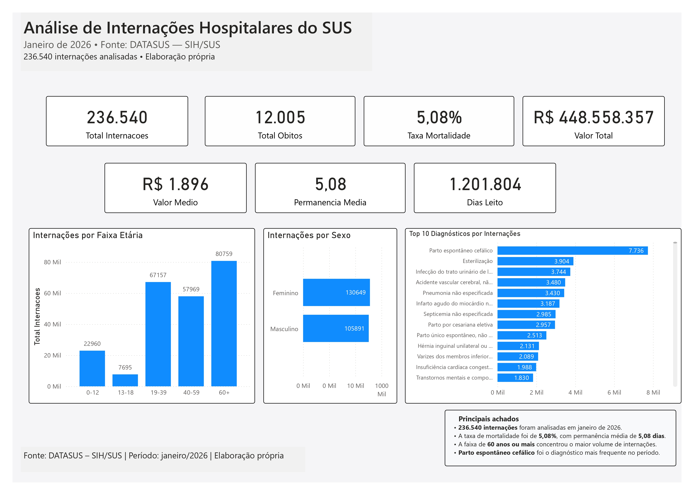
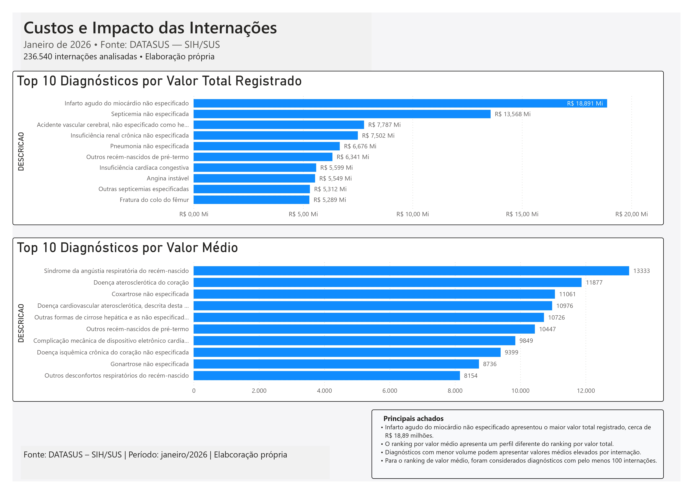
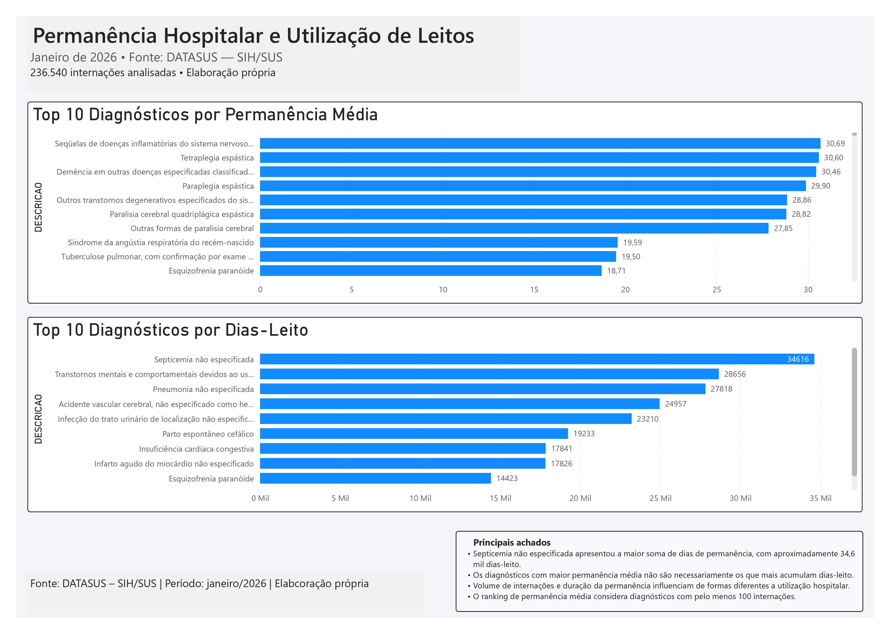
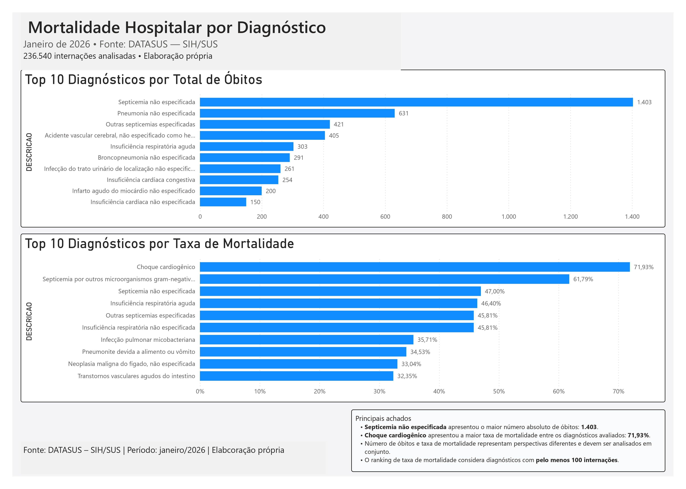

# Análise de Internações Hospitalares do SUS — Janeiro de 2026

## Sobre o projeto

Este projeto analisa dados públicos do Sistema de Informações Hospitalares do SUS (SIH/SUS), disponibilizados pelo DATASUS, referentes a janeiro de 2026.

O objetivo foi desenvolver uma análise completa utilizando SQL e Power BI, passando pelas etapas de exploração, tratamento, modelagem, validação e visualização dos dados.

Foram analisadas **236.540 internações**, buscando compreender o perfil das internações, os diagnósticos mais frequentes, mortalidade, permanência hospitalar, utilização de leitos e os valores registrados na base.

---

## Objetivos da análise

O projeto busca responder principalmente às seguintes perguntas:

1. Qual é o perfil das internações por sexo e faixa etária?
2. Quais diagnósticos apresentam maior número de internações?
3. Quais diagnósticos concentram os maiores valores registrados?
4. Quais diagnósticos apresentam maior valor médio por internação?
5. Quais diagnósticos apresentam maior permanência média?
6. Quais diagnósticos concentram maior quantidade acumulada de dias de permanência?
7. Quais diagnósticos apresentam maior número absoluto de óbitos?
8. Quais apresentam as maiores taxas de mortalidade?

---

## Fonte dos dados

**Fonte:** Ministério da Saúde — DATASUS  
**Sistema:** SIH/SUS — Sistema de Informações Hospitalares  
**Período analisado:** Janeiro de 2026

Os dados utilizados são provenientes de arquivos públicos disponibilizados pelo DATASUS.

> Os arquivos brutos não são armazenados neste repositório devido ao tamanho da base. O repositório contém os códigos, documentação e resultados necessários para reproduzir o processo analítico.

---

## Ferramentas utilizadas

- **Excel** — exploração inicial e compreensão da estrutura da base
- **MySQL** — armazenamento e consultas
- **SQL** — exploração, validação e análise
- **DBeaver** — execução e organização das consultas SQL
- **Power BI** — modelagem, medidas DAX e construção do dashboard
- **GitHub** — documentação e versionamento do projeto

---

## Processo do projeto

### 1. Exploração inicial

A primeira etapa foi utilizada para compreender a estrutura do SIH/SUS e identificar as variáveis mais relevantes para o projeto.

Entre os principais campos analisados estão:

- `SEXO`
- `IDADE`
- `RACA_COR`
- `DIAG_PRINC`
- `DIAS_PERM`
- `MORTE`
- `VAL_TOT`
- `DT_INTER`
- `DT_SAIDA`

### 2. Importação e análise em SQL

A base foi carregada no MySQL e validada antes do início das análises.

Após a importação foram confirmadas **236.540 internações**.

As consultas SQL foram utilizadas para validar os indicadores posteriormente apresentados no Power BI.

### 3. Modelagem da CID-10

Durante o desenvolvimento foi identificado um problema de granularidade nos códigos CID-10.

A base de internações possuía códigos em diferentes níveis:

- categorias CID-10 de 3 caracteres;
- subcategorias CID-10 de 4 caracteres.

Utilizar apenas a tabela de subcategorias gerava diagnósticos sem descrição no Power BI.

Para resolver o problema foi construída a dimensão:

`dim_cid10`

Essa dimensão unifica categorias e subcategorias, priorizando as subcategorias quando existe sobreposição de códigos e garantindo códigos únicos para o relacionamento com `DIAG_PRINC`.

O modelo final utiliza uma relação muitos-para-um entre:

`internacoes_jan_2026[DIAG_PRINC]`

e

`dim_cid10[CODIGO]`

### 4. Validação

Os principais indicadores e rankings do Power BI foram comparados diretamente com consultas SQL.

Essa etapa foi utilizada para verificar se os cálculos realizados no dashboard reproduziam corretamente os resultados encontrados no banco.

---

## Principais indicadores

| Indicador | Resultado |
|---|---:|
| Internações | 236.540 |
| Óbitos | 12.005 |
| Taxa de mortalidade | 5,08% |
| Valor total registrado | R$ 448.558.356,61 |
| Valor médio por internação | R$ 1.896,33 |
| Permanência média | 5,08 dias |
| Dias de permanência acumulados | 1.201.804 |

---

## Principais resultados

### Internações

O diagnóstico com maior número de internações foi **Parto espontâneo cefálico**, com **7.736 internações**.

A faixa etária de **60 anos ou mais** apresentou o maior volume de internações no período.

### Valores registrados

O **Infarto agudo do miocárdio não especificado** apresentou o maior valor total registrado entre os diagnósticos analisados, com aproximadamente **R$ 18,89 milhões**.

O ranking por valor médio apresenta um comportamento diferente do valor total, mostrando que diagnósticos com menor volume também podem apresentar valores elevados por internação.

### Permanência hospitalar

A **Septicemia não especificada** apresentou o maior volume acumulado de dias de permanência, com aproximadamente **34,6 mil dias**.

A análise também mostrou que diagnósticos com maior permanência média não são necessariamente aqueles que mais acumulam dias de internação.

### Mortalidade

A **Septicemia não especificada** apresentou o maior número absoluto de óbitos, com **1.403 mortes**.

Já o **Choque cardiogênico** apresentou a maior taxa de mortalidade entre os diagnósticos com pelo menos 100 internações, com aproximadamente **71,93%**.

---

## Critério para médias e taxas

Rankings baseados em médias e taxas podem ser muito influenciados por diagnósticos com poucas ocorrências.

Por esse motivo, para algumas análises foi aplicado um critério mínimo de **100 internações**, incluindo:

- valor médio;
- permanência média;
- taxa de mortalidade.

O objetivo desse critério foi reduzir o destaque de resultados baseados em volumes muito pequenos.

---

## Dashboard

O relatório desenvolvido no Power BI foi dividido em quatro páginas.

### Visão Geral

Apresenta os principais KPIs, distribuição por faixa etária e sexo e os diagnósticos com maior número de internações.



### Custos e Impacto

Compara os diagnósticos por valor total registrado e valor médio por internação.



### Permanência e Leitos

Analisa permanência média e dias de permanência acumulados por diagnóstico.



### Mortalidade

Apresenta os diagnósticos com maior número absoluto de óbitos e maiores taxas de mortalidade.



---

## Estrutura dos scripts SQL

Os scripts foram separados por responsabilidade:

```text
sql/
├── 01_validacao_kpis.sql
├── 02_perfil_internacoes.sql
├── 03_diagnosticos.sql
├── 04_custos.sql
├── 05_permanencia_leitos.sql
├── 06_mortalidade.sql
└── 07_modelagem.sql
